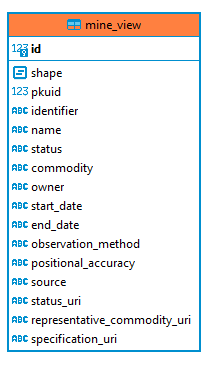

# GeoServer implementation

I suggest using WSL level 2 on Windows, so we can interact with docker with a Ubuntu console...  (https://docs.microsoft.com/en-us/windows/wsl/install-win10), make sure it's level 2.  This simplifies greatly command example as we can stick to linux.

I'm using oscarfonts docker image for geoserver (https://github.com/oscarfonts/docker-geoserver/)

to get the image, just run

`docker pull oscarfonts/geoserver`

that's it, you know have geoserver.

to launch GeoServer (we assume you are at the root of this repo), run this

`docker run -d -p 8080:8080 -v $(pwd)/data:/var/local/geoserver -v $(pwd)/ext:/var/local/geoserver-exts/ --name gs oscarfonts/geoserver`

BUT FIRST.. we you'll need to have a postgis database with mine_view table.  (I tried to use geopackage so we could skip the database installation part but could not make it work - I did not try hard)


*Note* that we are mapping the local `/data` folder to the geoserver data folder in the container, so the files we are editing are actually on the host machine (`/data`).  Did the same for `/ext` whene I loaded the appschema plugins (to map database structure to XML)

this is handy when you are trying to figure what's going on (you can inspect what happens when you change stuff in geoserver admin consoles, since the config file are sitting on your machin under a folder that both you and the container are sharing).  

This is obviously not the way to build your production system.  In a production system, you would create a Dockerfile that moves those config files inside the image and just run in a single package on the production environment

## Database

I use a database I called wheeler and create a schema called 'erml'.. just adjust as you see fit

```sql

--- table creation script

CREATE TABLE erml.mine_view (
	id serial NOT NULL,
	shape geometry(POINT, 4326) NULL,
	pkuid int8 NULL,
	identifier varchar NULL,
	"name" varchar NULL,
	status varchar NULL,
	commodity varchar NULL,
	"owner" varchar NULL,
	start_date varchar NULL,
	end_date varchar NULL,
	observation_method varchar NULL,
	positional_accuracy varchar NULL,
	"source" varchar NULL,
	status_uri varchar NULL,
	representative_commodity_uri varchar NULL,
	specification_uri varchar NULL,
	CONSTRAINT mine_view_pkey PRIMARY KEY (id)
);
```
insert script (as well as create script are in folder `/ddl`)


## setting connection

The key file to check in this example is : `workspaces/erml/erml_MineView/erml_MineView.xml` (in the `/data` folder, which is mapped to the containers `/var/local/geoserver` where geoserver expect those files)

It has two things.. first the datastore connection (here, postgis) and a mapping from the table to XML.

The fragment to connect to your own postgres database is (this is where you will tweak database name and schema name as well)


```xml
		<DataStore>
			<id>datastore</id>
			<parameters>
				<Parameter><name>dbtype</name><value>postgis</value></Parameter>
				<Parameter><name>host</name><value>192.168.0.110</value></Parameter>
				<Parameter><name>port</name><value>5432</value></Parameter>
				<Parameter><name>database</name><value>wheeler</value></Parameter>
				<Parameter><name>user</name><value>erml</value></Parameter>
				<Parameter><name>passwd</name><value>xxxx</value></Parameter>
				<Parameter><name>schema</name><value>erml</value></Parameter>
				<Parameter><name>Expose primary keys</name><value>true</value></Parameter>
			</parameters>
        </DataStore>
```


Note that inside the docker container "localhost" is *not* your machine, localhost is the container itself..  so you must figure the real IP of the machine running postgresql.

On Windows, `ipconfig` will do the trick.  On linux (Ubuntu at least, use `ip -c a` , but if postgres is running in Windows, use windows ipconfig, otherwise, it won't be the good ip)

(If you are home, you will have most certainly have a private 192.168.x.x)

```
Wireless LAN adapter Wi-Fi:

   Connection-specific DNS Suffix  . :
   Link-local IPv6 Address . . . . . : fe80::7c43:a80a:c941:af9%10
   IPv4 Address. . . . . . . . . . . : 192.168.0.104
   Subnet Mask . . . . . . . . . . . : 255.255.255.0
   Default Gateway . . . . . . . . . : 192.168.0.1
```

remember that your IP address can change as it is normally dynamically assiged (although you are normally assigned the same one if you keep using it)

## Mapping 

Table in the database is



to be transformed into ERML-lite instance (https://earthresourceml.org/earthresourceml-lite/2.0.1/examples/MineView_v2.0.1.xml)

```xml
<?xml version="1.0" encoding="UTF-8"?>
<erl:MineView     
    xmlns:erl="http://xmlns.earthresourceml.org/earthresourceml-lite/2.0"
    xmlns:xsi="http://www.w3.org/2001/XMLSchema-instance"
    xmlns:xlink="http://www.w3.org/1999/xlink"
    xmlns:gml="http://www.opengis.net/gml/3.2"
    xsi:schemaLocation="http://xmlns.earthresourceml.org/earthresourceml-lite/2.0 http://schemas.earthresourceml.org/earthresourceml-lite/2.0/erml-lite.xsd"
    gml:id="test_v2.0.1">
    <gml:identifier codeSpace="www.ga.gov.au">http://data.geoscience.gov.au/feature/ga/MineView/ga.MineView.123456</gml:identifier>
    <erl:identifier>http://data.geoscience.gov.au/feature/ga/MineView/ga.MineView.123456</erl:identifier>
    <erl:name>Lassiters</erl:name>
    <erl:status>operating</erl:status>
    <erl:commodity>gold, copper, silver</erl:commodity>
    <erl:owner>BHP Billiton</erl:owner>
    <erl:startDate>1978-01-01</erl:startDate>
    <erl:endDate>2009-01-01</erl:endDate>
    <erl:observationMethod>surveyed</erl:observationMethod>
    <erl:positionalAccuracy>0.5 metres</erl:positionalAccuracy>
    <erl:source>BHP Billiton Pty Ltd annual report, 2010</erl:source>
    <erl:status_uri>http://resource.geosciml.org/classifier/cgi/mine-status/operating</erl:status_uri>
    <erl:representativeCommodity_uri>http://resource.geosciml.org/classifier/cgi/commodity-code/precious-metal</erl:representativeCommodity_uri>
    <erl:specification_uri>http://data.geoscience.gov.au/feature/ga/mine/ga.mine.123456</erl:specification_uri>
    <erl:shape>
        <gml:Point srsName="epsg:4283" srsDimension="2" gml:id="GA.mineView.123456.point">          
            <gml:pos>138.234 -26.747467</gml:pos>
        </gml:Point>
    </erl:shape>
</erl:MineView>
```

The key file is the same,  `workspaces/erml/erml_MineView/erml_MineView.xml` (in data folder), just following the datastore fragment.  appschema is a whole mapping framework, so I won't discuss here..  Good documentation (but for GeoSciML is here http://www.onegeology.org/docs/technical/OneGeologyWFSCookbook_v1.3.pdf)


## checkin the result.

all set, you can 
GeoServer console is here http://localhost:8080/geoserver

default password for admin : admin/geoserver, you can explore (and change) the settings in there.

test : http://localhost:8080/geoserver/erml/ows?service=WFS&version=1.1.0&request=GetFeature&typeName=erml%3AMineView&outputFormat=gml32&maxFeatures=50

output (null values won't produce tags)

```xml
<?xml version="1.0" encoding="UTF-8"?>
<wfs:FeatureCollection xmlns:wfs="http://www.opengis.net/wfs/2.0" xmlns:xs="http://www.w3.org/2001/XMLSchema" xmlns:erml="http://xmlns.earthresourceml.org/earthresourceml-lite/2.0" xmlns:gml="http://www.opengis.net/gml/3.2" xmlns:xlink="http://www.w3.org/1999/xlink" xmlns:xsi="http://www.w3.org/2001/XMLSchema-instance" numberMatched="unknown" numberReturned="50" timeStamp="2020-12-29T00:50:42.642Z" xsi:schemaLocation="http://www.opengis.net/wfs/2.0 http://localhost:8080/geoserver/schemas/wfs/2.0/wfs.xsd http://xmlns.earthresourceml.org/earthresourceml-lite/2.0 https://earthresourceml.org/schemas/earthresourceml-lite/2.0/erml-lite.xsd http://www.opengis.net/gml/3.2 http://localhost:8080/geoserver/schemas/gml/3.2.1/gml.xsd">
	<wfs:boundedBy>
		<gml:Envelope>
			<gml:lowerCorner>44.9719 -79.2313</gml:lowerCorner>
			<gml:upperCorner>61.6872 -55.7753</gml:upperCorner>
		</gml:Envelope>
	</wfs:boundedBy>
	<wfs:member>
		<erml:MineView gml:id="175">
			<gml:identifier codeSpace="http://nrcan.gc.ca/gsc/tgi">1</gml:identifier>
			<gml:boundedBy>
				<gml:Envelope srsDimension="2" srsName="urn:ogc:def:crs:EPSG::4326">
					<gml:lowerCorner>49.845 -55.7753</gml:lowerCorner>
					<gml:upperCorner>49.845 -55.7753</gml:upperCorner>
				</gml:Envelope>
			</gml:boundedBy>
			<erml:identifier>1</erml:identifier>
			<erml:name>Nugget Pond</erml:name>
			<erml:commodity>Base metals</erml:commodity>
			<erml:owner>Rambler Metals and Mining PLC</erml:owner>
			<erml:source>mms</erml:source>
			<erml:shape>
				<gml:Point gml:id="mv.shape.175" srsDimension="2" srsName="urn:ogc:def:crs:EPSG::4326">
					<gml:pos>49.845 -55.7753</gml:pos>
				</gml:Point>
			</erml:shape>
		</erml:MineView>
	</wfs:member>
	<wfs:member>
		<erml:MineView gml:id="176">
			<gml:identifier codeSpace="http://nrcan.gc.ca/gsc/tgi">2</gml:identifier>
			<gml:boundedBy>
				<gml:Envelope srsDimension="2" srsName="urn:ogc:def:crs:EPSG::4326">
					<gml:lowerCorner>49.915 -56.087</gml:lowerCorner>
					<gml:upperCorner>49.915 -56.087</gml:upperCorner>
				</gml:Envelope>
			</gml:boundedBy>
			<erml:identifier>2</erml:identifier>
			<erml:name>Ming</erml:name>
			<erml:commodity>Base metals</erml:commodity>
			<erml:owner>Rambler Metals and Mining PLC</erml:owner>
			<erml:source>mms</erml:source>
			<erml:shape>
				<gml:Point gml:id="mv.shape.176" srsDimension="2" srsName="urn:ogc:def:crs:EPSG::4326">
					<gml:pos>49.915 -56.087</gml:pos>
				</gml:Point>
			</erml:shape>
		</erml:MineView>
	</wfs:member>
	<wfs:member>
		<erml:MineView gml:id="177">
			<gml:identifier codeSpace="http://nrcan.gc.ca/gsc/tgi">3</gml:identifier>
			<gml:boundedBy>
				<gml:Envelope srsDimension="2" srsName="urn:ogc:def:crs:EPSG::4326">
					<gml:lowerCorner>49.9614 -56.1244</gml:lowerCorner>
					<gml:upperCorner>49.9614 -56.1244</gml:upperCorner>
				</gml:Envelope>
			</gml:boundedBy>
			<erml:identifier>3</erml:identifier>
			<erml:name>Point Rousse</erml:name>
			<erml:commodity>Precious metals</erml:commodity>
			<erml:owner>Anaconda Mining Inc.</erml:owner>
			<erml:source>mms</erml:source>
			<erml:shape>
				<gml:Point gml:id="mv.shape.177" srsDimension="2" srsName="urn:ogc:def:crs:EPSG::4326">
					<gml:pos>49.9614 -56.1244</gml:pos>
				</gml:Point>
			</erml:shape>
		</erml:MineView>
	</wfs:member>
	<wfs:member>
		<erml:MineView gml:id="178">
			<gml:identifier codeSpace="http://nrcan.gc.ca/gsc/tgi">4</gml:identifier>
			<gml:boundedBy>
				<gml:Envelope srsDimension="2" srsName="urn:ogc:def:crs:EPSG::4326">
					<gml:lowerCorner>56.3317 -62.0909</gml:lowerCorner>
					<gml:upperCorner>56.3317 -62.0909</gml:upperCorner>
				</gml:Envelope>
			</gml:boundedBy>
			<erml:identifier>4</erml:identifier>
			<erml:name>Voisey’s Bay</erml:name>
			<erml:commodity>Base metals</erml:commodity>
			<erml:owner>Vale Newfoundland and Labrador Limited</erml:owner>
			<erml:source>mms</erml:source>
			<erml:shape>
				<gml:Point gml:id="mv.shape.178" srsDimension="2" srsName="urn:ogc:def:crs:EPSG::4326">
					<gml:pos>56.3317 -62.0909</gml:pos>
				</gml:Point>
			</erml:shape>
		</erml:MineView>
	</wfs:member>
</wfs:FeatureCollection>
```

== Troubleshooting

`docker logs <name-of-container>` is very useful to see if you get any errors from geoserver


=== Database configuration issues 

you might have an xml exception from OGC web services.  

```xml
<ows:ExceptionReport xmlns:xs="http://www.w3.org/2001/XMLSchema" xmlns:ows="http://www.opengis.net/ows" xmlns:xsi="http://www.w3.org/2001/XMLSchema-instance" version="1.0.0" xsi:schemaLocation="http://www.opengis.net/ows http://localhost:8080/geoserver/schemas/ows/1.0.0/owsExceptionReport.xsd">
<ows:Exception exceptionCode="NoApplicableCode">
<ows:ExceptionText>Error occurred getting features java.lang.RuntimeException: Unable to obtain connection: Cannot create PoolableConnectionFactory (FATAL: no pg_hba.conf entry for host "x.x.x.x", (blah blah blah)</ows:ExceptionText>
</ows:Exception>
</ows:ExceptionReport>
```

this means your postgres instance does not accept the connection from the container (so GeoServer running in the container).  
You'll need to edit `pg_hba.conf` postgres config file to let it in.

Postgres documentation : https://www.postgresql.org/docs/9.6/auth-pg-hba-conf.html

Up to you how strict you want to be

`host    all             all             0.0.0.0/0            md5`

will let everyone in (probably ok on your own laptop just for development purpose).

`host    all             all             192.168.0.0/16            md5`

will just let stuff running from your machine when running from home (local ISP)

or you can check the specific IP (in the error message), but remember it can change from one running instance to the other.

if you are running on a workplace network - better ask your admin


